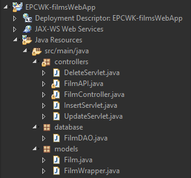
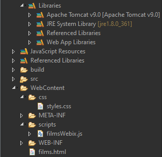

# Film Database Web Application

## Overview

A modular full-stack application designed to manage a film database using Java and modern web technologies. The system showcases REST and SOAP web services, a dynamic JavaScript frontend, and cloud database integration.

Users can browse, filter, and manage film records through an interactive Webix-based UI. Backend logic is structured using the MVC pattern, with REST endpoints capable of serving data in JSON, XML, and plain text formats.

---

## Features

- Full CRUD operations for film data
- RESTful API with content negotiation (JSON, XML, Text)
- SOAP service and test client for legacy support
- WebixJS UI with dynamic filtering, pagination, and modals
- Data persistence via MySQL (supports both local and cloud-hosted)
- Scalable, modular architecture using MVC and DAO

---

## Technologies Used

### Backend

- Java Servlets & JSP (`FilmController`, `InsertServlet`, `UpdateServlet`, `DeleteServlet`)
- DAO Pattern (`FilmDAO`)
- RESTful API (`FilmAPI`)
- SOAP (JAX-WS, JAXB)
- MySQL / AWS RDS
- Apache Tomcat

### Frontend

- HTML / CSS
- JavaScript (`filmsWebix.js`)
- WebixJS Library

---

## Architecture Overview

### Model

- `Film.java` – Represents a single film record.
- `FilmWrapper.java` – A JAXB wrapper for lists of films, used for XML formatting.

### Controller (REST & MVC)

- `FilmController.java` – Main servlet for handling UI navigation and HTTP forwarding.
- `InsertServlet.java`, `UpdateServlet.java`, `DeleteServlet.java` – Handle CRUD via form submissions.
- `FilmAPI.java` – REST endpoint with `GET`, `POST`, `PUT`, `DELETE` methods. Responds in JSON/XML/Text.

### Data Access

- `FilmDAO.java` – Encapsulates all database operations and interaction logic using JDBC with connection handling, result set parsing, and SQL sanitization via prepared statements.

---

## REST API Endpoints

- `GET /filmapi?type=json` – All films in JSON
- `GET /filmapi?type=xml` – All films in XML
- `GET /filmapi?type=text/plain` – All films in plain text
- `POST /filmapi` – Add new film
- `PUT /filmapi` – Update existing film
- `DELETE /filmapi?id=<id>` – Delete film by ID

---

## Frontend (WebixJS)

- Located in `films.html` and `filmsWebix.js`
- Features:
  - Pagination
  - Column filtering and resizing
  - Modal forms for insert/update
  - Delete confirmation dialog
  - Format toggle (JSON/XML/Text)
- All interactions via AJAX to REST API

---

## Cloud Deployment

- AWS-hosted MySQL instance
- `FilmDAO` supports remote database endpoint
- Validated CRUD operations through cloud DB and REST API

---

## Setup Instructions

### Prerequisites

- Java 8+
- Apache Tomcat 9+
- MySQL Server (or AWS RDS)
- Maven
- Web browser

### Steps

1. Set up MySQL DB using provided schema.
2. Configure credentials in `FilmDAO.java`.
3. Deploy the `.war` file to your Tomcat server.
4. Navigate to:

```
http://localhost:8085/EPCWK-filmsWebApp/films.html
```

5. Use the UI or REST tools like Postman to test endpoints.

---

## Project Structure

 

---

## Screenshots

<See [EP Assignment - Evidence Screenshots.docx](https://github.com/KyoHiroshi/filmsWebApp/blob/main/EP%20Screenshots.docx)>

---

## Future Improvements

- Introduce token-based authentication
- Migrate frontend to React for a more modern SPA experience
- Implement a configuration service for dynamic DB credential handling
- Add client-side form validation and error handling

---

## License

Available for educational and demonstrative use. Contact the author for commercial or production use inquiries.
